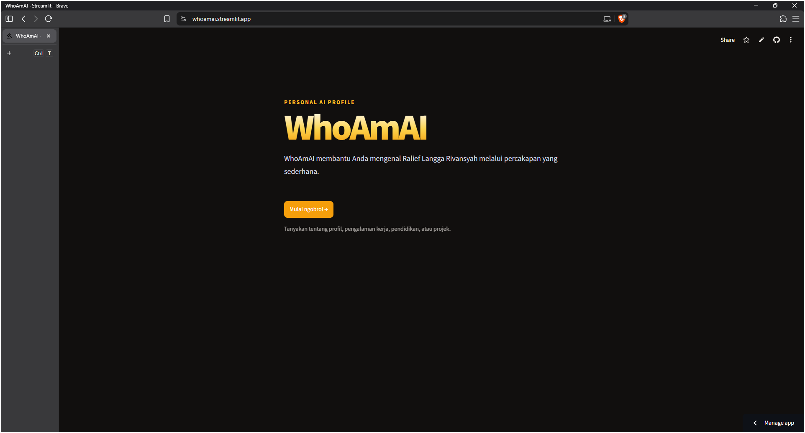

# WhoAmAI

WhoAmAI adalah chatbot profil personal berbasis **Retrieval-Augmented Generation (RAG)**. Aplikasi ini membantu pengguna mendapatkan informasi tentang **Ralief Langga Rivansyah** berdasarkan dokumen profil yang tersedia di folder `knowledge_docs/`.



## Fitur

- Landing page profil dan antarmuka chat interaktif menggunakan Streamlit.
- Memuat file `.txt` dari folder `knowledge_docs/`.
- Membagi dokumen menjadi potongan teks (*chunks*).
- Membuat dan menyimpan embedding di ChromaDB.
- Mengambil hingga delapan potongan dokumen yang relevan untuk setiap pertanyaan.
- Menghasilkan jawaban menggunakan model Groq melalui LangChain.
- Menyimpan riwayat percakapan selama sesi Streamlit.
- Memisahkan aturan perilaku chatbot ke [`system_prompt.md`](system_prompt.md).

## Alur aplikasi

```text
knowledge_docs/*.txt
        │
        ▼
TextLoader
        │
        ▼
RecursiveCharacterTextSplitter
        │
        ▼
Embedding ───────────────► ChromaDB
                              │
Pertanyaan pengguna ──────────┘
        │
        ▼
Retriever (top-k = 8)
        │
        ▼
System prompt + konteks dokumen
        │
        ▼
ChatGroq
        │
        ▼
Jawaban di Streamlit
```

Logika RAG berada di [`rag_chatbot.py`](rag_chatbot.py), sedangkan antarmuka dan riwayat sesi berada di [`app.py`](app.py).

## Prasyarat

- Python 3.10 atau lebih baru.
- API key Groq.
- Koneksi internet untuk mengakses model Groq dan mengunduh model embedding saat diperlukan.

## Instalasi

1. Masuk ke folder proyek:

   ```bash
   cd WhoAmAI_Chatbot
   ```

2. Buat dan aktifkan virtual environment:

   ```bash
   python -m venv .venv
   ```

   Windows PowerShell:

   ```powershell
   .\.venv\Scripts\Activate.ps1
   ```

3. Install dependency:

   ```bash
   pip install -r requirements.txt
   ```

4. Buat file `.env` di root proyek:

   ```env
   GROQ_API_KEY=isi_dengan_api_key_groq
   ```

   Jangan commit atau membagikan file `.env`.

## Menjalankan aplikasi

### Antarmuka Streamlit

```bash
streamlit run app.py
```

Buka URL yang ditampilkan Streamlit, biasanya `http://localhost:8501`.

Saat aplikasi dimulai, aplikasi akan:

1. Menampilkan landing page profil.
2. Setelah tombol **Mulai ngobrol** ditekan, memeriksa `GROQ_API_KEY`.
3. Memuat file `.txt` dari `knowledge_docs/`.
4. Membuat potongan dokumen dan vector store ChromaDB.
5. Menyiapkan retriever dengan `top-k` sebanyak 8.
6. Memuat aturan dari `system_prompt.md`.
7. Menyiapkan RAG chain dan menyimpannya di cache resource Streamlit.

## Cara menggunakan

Saat pertama kali dibuka, tekan **Mulai ngobrol** pada landing page untuk
membuka chatbot. Dari sidebar chatbot, gunakan **Kembali ke landing page**
untuk kembali ke halaman awal.

Contoh pertanyaan:

- `Siapa itu Ralief Langga Rivansyah?`
- `Apa saja keahlian teknisnya?`
- `Proyek apa yang pernah dikerjakan?`
- `Bagaimana cara menghubungi Ralief berdasarkan profil?`

Jawaban chatbot dibatasi oleh isi dokumen sumber dan aturan di [`system_prompt.md`](system_prompt.md). Jika informasi yang ditanyakan tidak tersedia di konteks dokumen, chatbot seharusnya menyatakan bahwa informasi tersebut tidak ditemukan.

## Konfigurasi RAG

Konfigurasi utama berada di bagian atas [`rag_chatbot.py`](rag_chatbot.py):

| Konfigurasi | Nilai | Fungsi |
|---|---:|---|
| `CHAT_MODEL` | `openai/gpt-oss-120b` | Model chat yang dipanggil melalui Groq |
| `COLLECTION_NAME` | `chatbot_history` | Nama koleksi ChromaDB |
| `CHUNK_SIZE` | `800` | Ukuran maksimum potongan teks |
| `CHUNK_OVERLAP` | `100` | Tumpang tindih antar-potongan |
| `TOP_K` | `8` | Jumlah potongan dokumen yang diambil retriever |
| `KNOWLEDGE_DIR` | `./knowledge_docs` | Folder dokumen sumber |
| `SYSTEM_PROMPT_PATH` | `./system_prompt.md` | Lokasi aturan perilaku chatbot |

Model menggunakan `temperature=0` dan `reasoning_effort="low"`.

## Struktur proyek

```text
WhoAmAI_Chatbot/
├── app.py                         # Antarmuka Streamlit dan riwayat sesi
├── rag_chatbot.py                 # Ingestion, retrieval, prompt, dan RAG chain
├── system_prompt.md               # Aturan perilaku chatbot
├── requirements.txt               # Dependency Python
├── knowledge_docs/                # Dokumen TXT sumber pengetahuan
│   └── AI KNOWLEDGE BASE.txt
├── Homepage.png                   # Screenshot tampilan aplikasi
├── .streamlit/
│   └── config.toml                # Konfigurasi tema Streamlit
├── .devcontainer/
│   └── devcontainer.json          # Konfigurasi development container
└── .gitignore                     # Pengecualian file lokal dan secret
```

Folder `__pycache__/` adalah hasil proses lokal dan tidak perlu disimpan ke version control.

## Batasan

- Kualitas jawaban bergantung pada kelengkapan dan kualitas dokumen `.txt` di `knowledge_docs/`.
- Aplikasi memerlukan `GROQ_API_KEY` dan koneksi ke layanan Groq.
- Riwayat percakapan hanya disimpan selama sesi Streamlit dan tidak menggunakan database permanen.
- Belum ada sistem autentikasi atau pembatasan akses.
- Pipeline saat ini hanya membaca file `.txt`.
- Chatbot hanya menggunakan dokumen lokal sebagai sumber informasi dan tidak melakukan pencarian internet.
